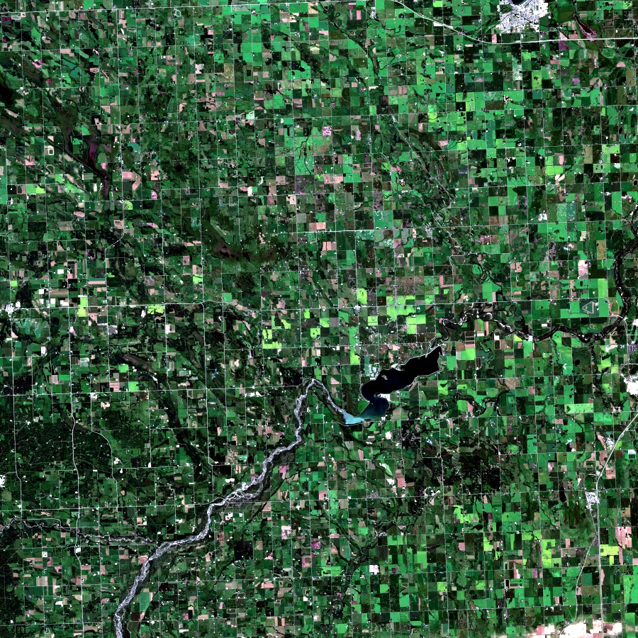

```@meta
CurrentModule = RemoteSensingToolbox
```

# Principal Component Analysis

Remotely sensed imagery typically consists of anywhere from five to several hundred spectral bands. These bands are often highly correlated because they occupy similar spectral regions. 

PCA is used in remote sensing to:
- Create a smaller dataset from multiple bands, while retaining as much of the original spectral information as possible. The new image will consist of several uncorrelated PC bands.
- Reveal complex relationships among spectral features.
- Determine which characteristics are prevalent in most of the bands, and those that are specific to only a few.

Our first step is to load and visualize our data.

```julia
using RemoteSensingToolbox, Rasters, ArchGDAL, DataDeps, Fetch
using Pipe: @pipe

# DataDeps Settings
ENV["DATADEPS_ALWAYS_ACCEPT"] = true
ENV["DATADEPS_LOAD_PATH"] = joinpath(pwd(), "data")

# Fetch Sentinel 2 Scene from Google Drive
register(
    DataDep(
        "S2B_MSIL2A_20200804T183919_N0214_R070_T11UPT_20200804T230343", 
        """Sentinel 2 Test Data""", 
        "https://drive.google.com/file/d/1P7TSPf_GxYtyOYat3iIui1hbjvb7H6a0/view?usp=sharing", 
        "4135c6192a314e0d08d21cf44ca3cde0f34f1968854275e32656278ca163a3e0", 
        fetch_method=gdownload, 
        post_fetch_method=unpack
    )
)

# Read Sentinel 2 Bands at 60m Resolution
src = Sentinel2{60}(datadep"S2B_MSIL2A_20200804T183919_N0214_R070_T11UPT_20200804T230343")
sentinel = RasterStack(src; lazy=false)

# Extract Region of Interest
roi = @view sentinel[Rasters.X(900:1799), Rasters.Y(1:900)]

# Visualize Original Image
true_color(Sentinel2{60}, roi; upper=0.99)
```



Next, we'll fit a PCA transformation to our image. We can optionally specify a fraction of 
pixels to use for computing the transformation statistics. Choosing a value less than one can
greatly reduce the computation time at the expense of precision. However, for sufficiently large 
images, a fraction of 0.1 provides near-identical results to those acquired from the complete data 
set.

```julia
pca = fit_pca(sentinel; method=:cov, stats_fraction=0.1)
```
```
PCA(dimensions=11) 

Projection Matrix:
11×11 Matrix{Float32}:
 -0.026   -0.2068   0.359    0.312   -0.0956  -0.4791  -0.2246   0.6115  -0.187   -0.1491   0.1007
 -0.0361  -0.2354   0.3739   0.1417  -0.0496  -0.1544  -0.384   -0.3905   0.3475   0.2424  -0.5269
 -0.0775  -0.2406   0.3554  -0.1492   0.0608   0.0574  -0.0611  -0.2325   0.4331  -0.2812   0.6754
 -0.0396  -0.3231   0.321   -0.0301  -0.048    0.4006  -0.1104  -0.1695  -0.6672   0.3335   0.1734
 -0.1194  -0.2914   0.2233  -0.3824   0.3988   0.3537   0.1552   0.388    0.0935  -0.2656  -0.4083
 -0.3925   0.0354   0.0791  -0.5716   0.1024  -0.5641   0.2124  -0.0647  -0.1093   0.3454   0.0492
 -0.4949   0.1513   0.0179  -0.1063  -0.4124   0.0177  -0.1552  -0.2315  -0.2583  -0.6104  -0.1825
 -0.5216   0.1354  -0.1415  -0.0112  -0.2273   0.3424  -0.332    0.3901   0.3023   0.3891   0.1241
 -0.5257   0.084    0.0977   0.6027   0.4321   0.0232   0.3684  -0.1417  -0.0191   0.0176   0.0145
 -0.155   -0.549   -0.63     0.0249   0.3084  -0.1467  -0.3609  -0.0952  -0.0891  -0.098    0.0592
 -0.0695  -0.5511  -0.1381   0.1059  -0.5562   0.0012   0.5628   0.0345   0.1566   0.0705  -0.0666

Importance of Components:
  Cumulative Variance: 0.76  0.9679  0.989  0.9938  0.9968  0.9984  0.9991  0.9995  0.9998  ...  1.0
  Explained Variance: 0.76  0.2078  0.0212  0.0047  0.0031  0.0016  0.0007  0.0004  0.0002  ...  0.0001
```

If we look at the cumulative variance, we see that we only need to retain the first three principal 
components to account for 98.9% of the sample variance. Knowing this, we'll perform a forward rotation with `forward_pca` while specifying that we only want to keep the first three components.

```julia
# Perform a PCA Transformation while Retaining the First Three Components
transformed = forward_pca(pca, roi, 3)

# Visualize Transformation
r, g, b = (view(transformed, Rasters.Band(i)) for i in 1:3)
visualize(r, g, b; upper=0.99)
```


Each band in the transformed image corresponds to a linear combination of multiple bands from the 
original image. Thus, the bands no longer relate to wavelengths of light, but instead capture 
different characteristics of the underlying spectral signatures. In the above visualization, we 
observe that water is highlighted in yellow, vegetation is green, and built-up land is magenta. 

We may also wish to reverse the transformation in order to recover an approximation of the original 
image. This can be achieved with the `inverse_pca` method, which expects both a learned PCA rotation 
and a previously transformed image as input. The return value is a `Raster`, which does not retain 
any of the band names from the original image. To make our recovered image compatible with the 
`Sentinel2` type, we need to restore the layer names by passing the result to `RasterStack`.

```julia
# Reverse Transformation
recovered = RasterStack(inverse_pca(pca, transformed), layersfrom=Band, name=names(roi))

# Visualize Recovered Image
true_color(Sentinel2{60}, recovered; upper=0.99)
```


We can see that while the color of the recovered image is indeed similar to that of the original,
there are some noticeable discrepancies. This is because some information was lost when we discarded
the other eight principal components. Had we elected to retain all 11 components, we would find the 
two images to be identical, minus some floating point error.