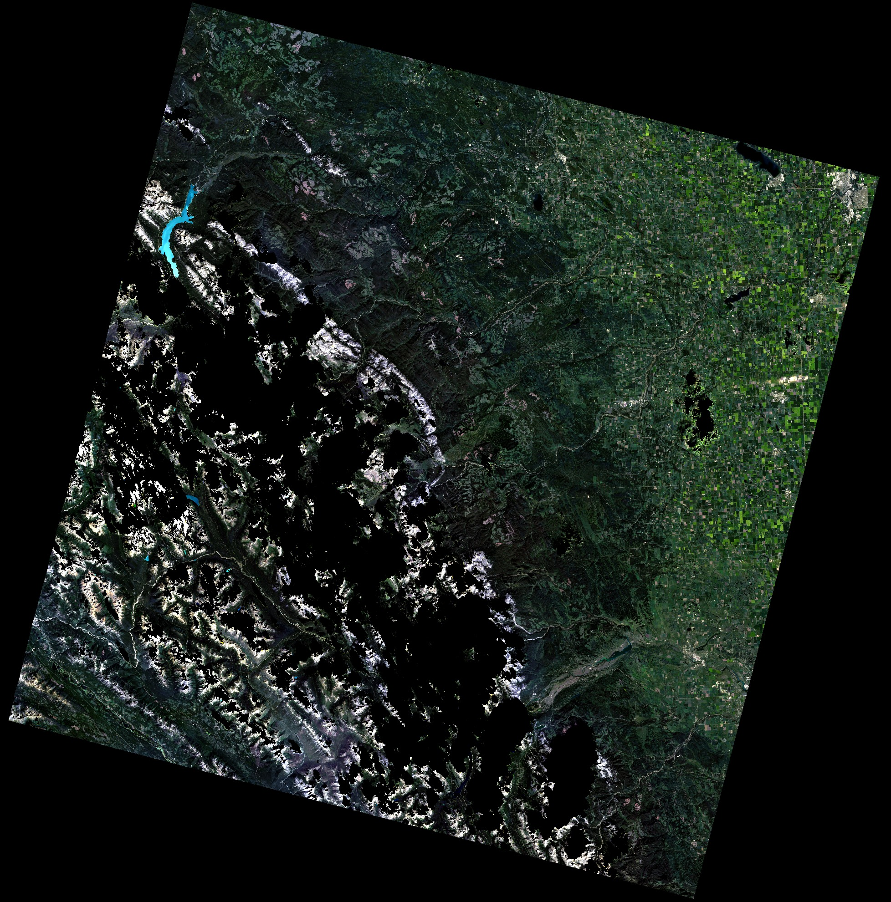
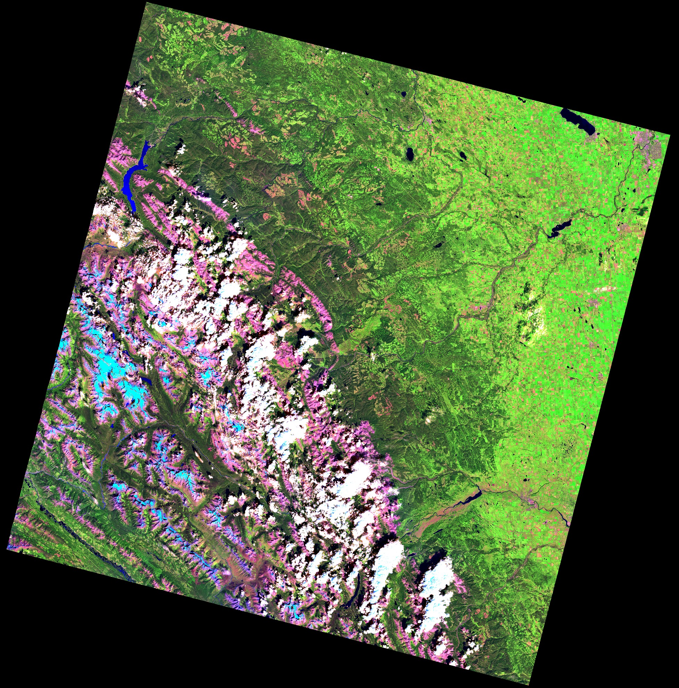

```@meta
CurrentModule = RemoteSensingToolbox
```

# Quick Start

`RemoteSensingToolbox` is a pure Julia package which provides a number of utilities for reading, visualizing, and
processing remotely sensed imagery. When working with such data, the user is often faced with the need to adapt their
approach according to the type of sensor that produced it. For example, decoding digital numbers into radiance, 
reflectance, or temperature requires knowledge about the encoding scheme used by the satellite product in question.
The address these issues, we provide several `AbstractSatellite` types, which encode various parameters at the type
level. 

Typically, the first step in a workflow is to read the desired layers from disk. To do so, we first need to place
our product within the appropriate context; in this case `Landsat8`. With this done, we can load whichever
layers we desire simply by asking for them by name. A complete list of all available layers can be acquired by
calling `layers(Landsat8)`. To load a single layer, we typically use a `Raster`, while a `RasterStack` is used 
when loading multiple layers at once. By default, `RasterStack` will read all of the spectral layers when no
layers are specified. We can also specify the keyword `lazy=true` to avoid loading everything into memory. When 
doing so, the raster(s) will not be retrieved from disk until explicitly indexed or read.

```julia
using RemoteSensingToolbox, Rasters, ArchGDAL, DataDeps, Fetch

# DataDeps Settings
ENV["DATADEPS_ALWAYS_ACCEPT"] = true
ENV["DATADEPS_LOAD_PATH"] = joinpath(pwd(), "data")

# Fetch Landsat Scene from Google Drive
register(
    DataDep(
        "LC08_L2SP_043024_20200802_20200914_02_T1", 
        "Landsat 8 Test Data",
        "https://drive.google.com/file/d/1S5H_oyWZZInOzJK4glBCr6LgXSADzhOV/view?usp=sharing", 
        "2ce24abc359d30320213237d78101d193cdb8433ce21d1f7e9f08ca140cf5785", 
        fetch_method=gdownload, 
        post_fetch_method=unpack
    )
)

# Read Landsat Bands
src = Landsat8(datadep"LC08_L2SP_043024_20200802_20200914_02_T1")
stack = RasterStack(src, lazy=true)
```

Now let's visualize our data to see what we're working with. The `true_color` method displays the red, green, and
blue bands to provide an image that is familiar to the human eye. In most other frameworks, we would have to specify
each of these bands individually, which in turn requires knowledge about the sensor in question. However, because
we have placed our scene within a `Landsat8` context, `true_color` is smart enough to figure this out on its own.
As an alternative, we could have also called `true_color(Landsat8, stack; upper=0.90)`, which requires passing in
the sensor type as the first agument and a stack containing the relevant bands as the second. Many other methods 
in `RemoteSensingToolbox` follow this same pattern.

```julia
true_color(src; upper=0.90)
```


You may have noticed that we provided an additional argument `upper` to `true_color`. This parameter controls the 
upper quantile to be used during the histogram adjustment. This parameter is set to 0.98 by default, but because 
our scene contains a significant number of bright clouds, we need to lower it to prevent the image from appearing 
too dark. We can remove these clouds by loading the `:clouds` and `:cloud_shadow` layers from the provided scene and
then calling `apply_masks`.

```julia
# Mask Clouds
cloud_mask = Raster(src, :clouds)
shadow_mask = Raster(src, :cloud_shadow)
masked = apply_masks(stack, cloud_mask, shadow_mask)

# Visualize in True Color
true_color(Landsat8, masked)
```



Now let's try to visualize some other band combinations. The `Agriculture` band comination is commonly used to 
emphasize regions with healthy vegetation, which appear as various shades of green.

```julia
agriculture(src; upper=0.90)
```


We'll finish this example by computing a few different land cover indices. Each index expects two bands as input, 
such as green and swir (MNDWI), red and nir (NDVI), or nir and swir (NDMI). As with visualization, we do
not need to specify these bands manually so long as the type of sensor is known. In general, each index has 
three forms: one that requires only a single `AbstractSatellite` instance, a second that expects both the type 
of satellite and a `RasterStack`, and a third which expects a `Raster` for each band.

```julia
# Extract Region of Interest
roi = @view masked[X(5800:6800), Y(2200:3200)]

# Calculate Indices
indices = map(visualize, [mndwi(Landsat8, roi), ndvi(Landsat8, roi), ndmi(Landsat8, roi)])

# Visualize
tc = true_color(Landsat8, roi; upper=0.998)
mosaic = mosaicview([tc, indices...]; npad=10, fillvalue=0.0, ncol=2, rowmajor=true)
```

