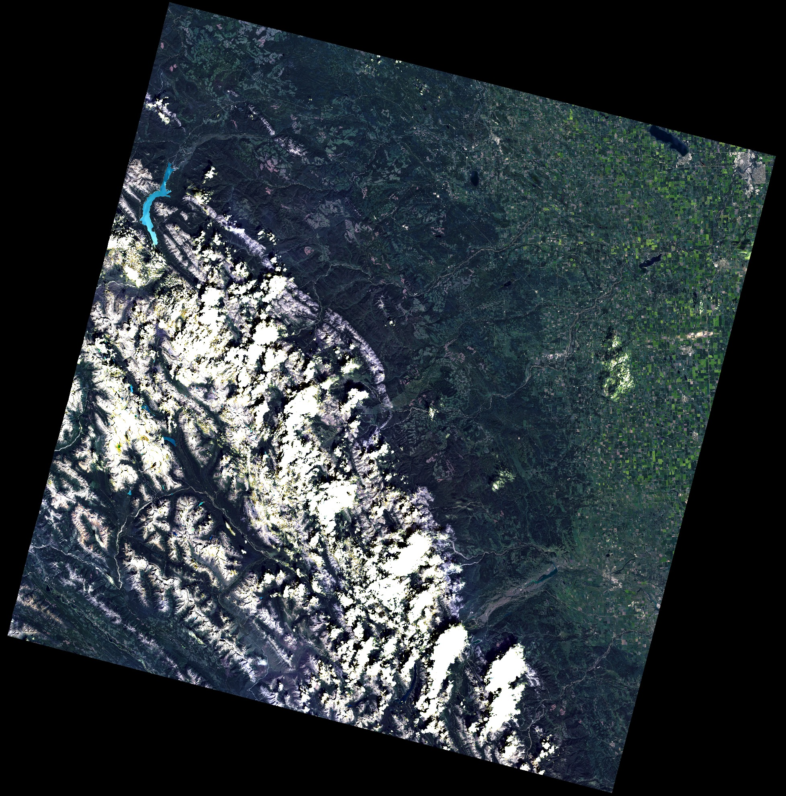
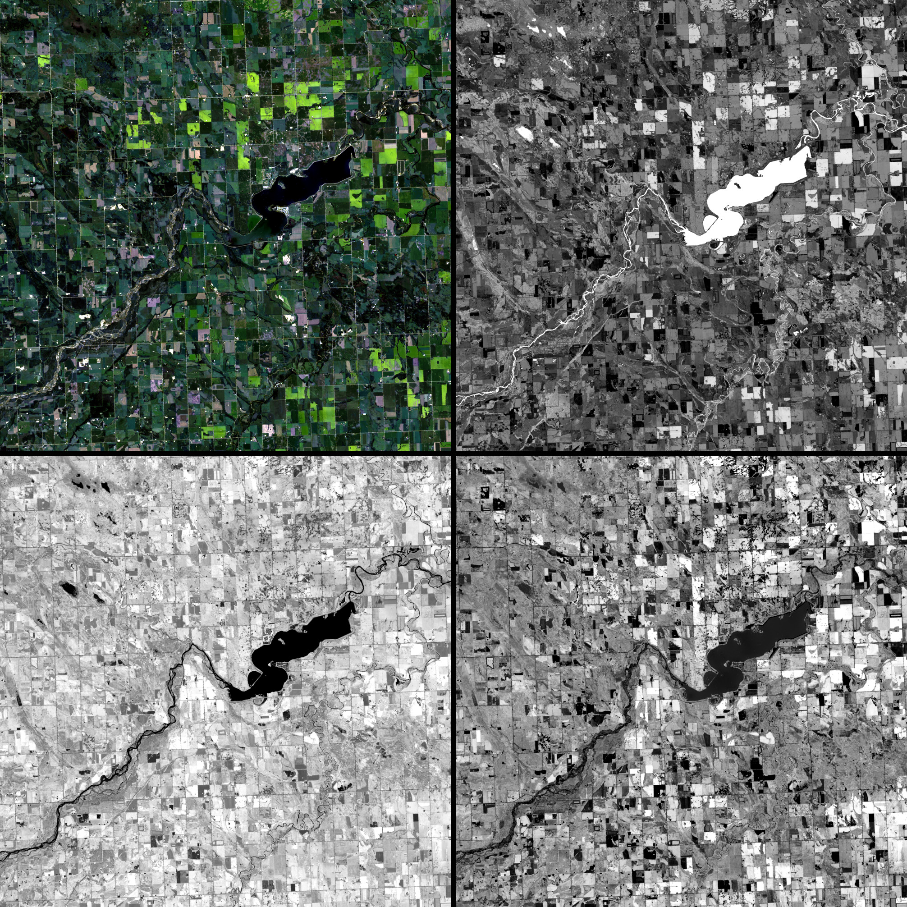

```@meta
CurrentModule = RemoteSensingToolbox
```

# Quick Start

`RemoteSensingToolbox` is a pure Julia package which provides a number of utilities for reading, visualizing, and
processing remotely sensed imagery. When working with such data, the user is often faced with the need to adapt their
approach according to the type of sensor that produced it. For example, decoding digital numbers into radiance, 
reflectance, or temperature requires knowledge about the encoding scheme used by the satellite product in question.
The address these issues, we provide several `AbstractSatellite` types, which encode various parameters at the type
level. 

Typically, the first step in a workflow is to read the desired layers from disk. To do so, we first need to place
our product within the appropriate context; in this case `Landsat8`. With this done, we can load whichever
layers we desire by simply requesting them by name. A complete list of all available layers can be acquired by
calling `layers(Landsat8)`. We typically use a `Raster` to load a single layer, while a `RasterStack` is used 
to load multiple layers at once. By default, `RasterStack` will read all of the band layers when none are
specified. We can also set `lazy=true` to avoid reading everything into memory up-front.

```julia
using RemoteSensingToolbox, Rasters

# Read Landsat Bands
src = Landsat8("data/LC08_L2SP_043024_20200802_20200914_02_T1")
stack = RasterStack(src, lazy=true)
```

Now let's visualize our data to see what we're working with. The `true_color` method uses the red, green, and
blue bands to produce an image that is familiar to the human eye. In most other frameworks, we would have to specify
each of these bands individually, which in turn requires knowledge about the sensor in question. However, because
we have placed our scene within a `Landsat8` context, `true_color` is smart enough to figure this out on its own.
As an alternative, we could have also called `true_color(Landsat8, stack; upper=0.90)`, which requires passing in
the sensor type as the first agument and a `RasterStack` containing the required bands as the second. Many 
other methods in `RemoteSensingToolbox` follow this same pattern.

```julia
true_color(src; upper=0.90)
```



You may have noticed that we set the keyword `upper` to 0.90. This parameter defines the upper quantile that 
is used during histogram adjustment and is set to 0.98 by default. However, the presence of bright clouds
requires us to lower it in order to prevent the image from appearing too dark. We can remove these clouds by
passing the cloud and cloud shadow masks into the `apply_masks` method. As with other layers, we can simply 
request them by name.

```julia
# Mask Clouds
cloud_mask = Raster(src, :clouds)
shadow_mask = Raster(src, :cloud_shadow)
masked = apply_masks(stack, cloud_mask, shadow_mask)

# Visualize in True Color
true_color(Landsat8, masked)
```


Now let's try to visualize some other band combinations. The `Agriculture` band combination is commonly used to 
emphasize regions with healthy vegetation, which appear as various shades of green.

```julia
agriculture(src; upper=0.90)
```


We'll finish this example by computing a few different land cover indices. Each index expects two bands as input, 
such as green and swir (MNDWI), red and nir (NDVI), or nir and swir (NDMI). As with visualization, we do
not need to specify these bands manually so long as the sensor type is known. In general, each index has 
three forms: one that requires only a single `AbstractSatellite` instance, a second that expects both the type 
of satellite and a `RasterStack`, and a third which expects a `Raster` for each band.

```julia
# Extract Region of Interest
roi = @view masked[X(5800:6800), Y(2200:3200)]

# Calculate Indices
indices = map(visualize, [mndwi(Landsat8, roi), ndvi(Landsat8, roi), ndmi(Landsat8, roi)])

# Visualize
tc = true_color(Landsat8, roi; upper=0.998)
mosaic = mosaicview([tc, indices...]; npad=10, fillvalue=0.0, ncol=2, rowmajor=true)
```

