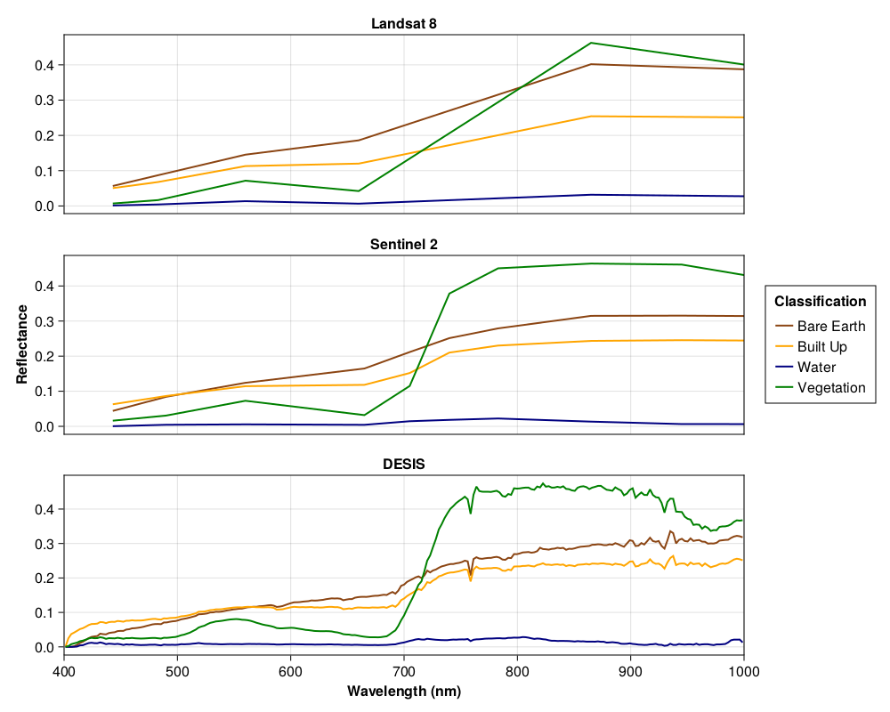

```@meta
CurrentModule = RemoteSensingToolbox
```

# Spectral Analysis

A common application of remotely sensed imagery is land cover classification. One method to accomplish this is to analyze the spectral signatures produced by different types of cover. `RemoteSensingToolbox` provides a number of functions for extracting and visualyzing spectral signatures organized by their associated lan cover.

The first step in our analysis is to load our remotely sensed data and convert the DNs (Digital Numbers) to reflectances. Reflectance is a standardized unit of measurement defined over the interval [0, 1] which denotes the fraction of light that is reflected by the observed surface. A reflectance of 0.0 indicates that no light was reflected whereas a reflectance of 1.0 indicates that 100% of light was reflected.

```julia
using RemoteSensingToolbox, DataFrames, Shapefile, CairoMakie
using Pipe: @pipe

landsat = @pipe Landsat8("data/LC08_L2SP_043024_20200802_20200914_02_T1/") |> dn_to_reflectance(Landsat8, _)
```

Next, we need to load a shapefile which defines some regions containing each type of land cover that we're interested in.

```julia
shp = Shapefile.Table("data/landcover/landcover.shp") |> DataFrame
```

Examining the shapefile gives us some idea of how its contents are structured. As we can see, the regions of interest are stored as `Polygon` objects under the `:geometry` column, while the land cover types are under `:MC_name` and `:C_name`. The `:MC_name` column defines the macroclass, which in our case are built up land, vegetation, bare earth, and water. The `:C_name` column defines the specific class to which some land cover belongs. For example, both "Trees" and "Vegetation" belong to the "Vegetation" macroclass.

```
8×7 DataFrame
 Row │ geometry            fid      MC_ID  MC_name     C_ID   C_name      SCP_UID                   
     │ Polygon             Missing  Int64  String      Int64  String      String                    
─────┼──────────────────────────────────────────────────────────────────────────────────────────────
   1 │ Polygon(38 Points)  missing      1  Built Up        1  Built Up    20230527_122212594060_314
   2 │ Polygon(31 Points)  missing      1  Built Up        2  Road        20230527_122301732906_304
   3 │ Polygon(7 Points)   missing      2  Vegetation      3  Vegetation  20230527_122832068862_302
   4 │ Polygon(57 Points)  missing      2  Vegetation      4  Trees       20230527_123221462871_572
   5 │ Polygon(5 Points)   missing      3  Bare Earth      5  Hail Scar   20230527_123631491671_937
   6 │ Polygon(7 Points)   missing      3  Bare Earth      6  Bare Earth  20230527_123727873290_779
   7 │ Polygon(7 Points)   missing      4  Water           7  Lake        20230527_123931189139_867
   8 │ Polygon(5 Points)   missing      3  Bare Earth      6  Bare Earth  20230527_125120033074_286
```

We can extract the signatures inside each polygon with `extract_signatures`. This method returns a `RasterTable`, which is a special type optimized for extracting
tablular data from a raster data source. Because `RasterTable` implements the `Tables.jl` interface, it can be directly sunk into other table constructors, such as 
`DataFrames`, and is also compatible with external libraries like `TableOperations.jl`.

```julia
sigs = extract_signatures(landsat, shp, :C_name) |> DataFrame
```

```
1925×8 DataFrame
  Row │ B1         B2         B3        B4        B5        B6        B7        label     
      │ Float32    Float32    Float32   Float32   Float32   Float32   Float32   String    
──────┼───────────────────────────────────────────────────────────────────────────────────
    1 │ 0.057235   0.10547    0.188932  0.24847   0.513405  0.315323  0.166107  Hail Scar
    2 │ 0.0574     0.105415   0.188712  0.24946   0.513735  0.317908  0.167593  Hail Scar
    3 │ 0.0584175  0.107175   0.19182   0.253887  0.515577  0.319585  0.168087  Hail Scar
    4 │ 0.0583625  0.10723    0.190995  0.253393  0.514615  0.317715  0.167097  Hail Scar
    5 │ 0.05806    0.10745    0.189895  0.250368  0.50774   0.315048  0.165475  Hail Scar
    6 │ 0.05553    0.102885   0.184175  0.243272  0.498417  0.307485  0.160938  Hail Scar
    7 │ 0.05267    0.0983475  0.176585  0.230073  0.48783   0.29159   0.153292  Hail Scar
  ⋮   │     ⋮          ⋮         ⋮         ⋮         ⋮         ⋮         ⋮          ⋮
 1919 │ 0.0320725  0.05993    0.11306   0.127415  0.272258  0.27322   0.220777  Built Up
 1920 │ 0.100575   0.127168   0.199218  0.23164   0.285677  0.323985  0.258645  Built Up
 1921 │ 0.077145   0.112097   0.17081   0.19677   0.25705   0.320877  0.28015   Built Up
 1922 │ 0.10712    0.136765   0.19666   0.225068  0.268655  0.33284   0.302288  Built Up
 1923 │ 0.0856425  0.123235   0.185853  0.211675  0.273     0.373623  0.351072  Built Up
 1924 │ 0.088145   0.119578   0.17059   0.204442  0.27487   0.355857  0.325553  Built Up
 1925 │ 0.0518725  0.0816275  0.148673  0.15189   0.28774   0.309218  0.29786   Built Up
                                                                         1911 rows omitted
```

While `extract_signatures` can be a good first step for further statistical analysis or training classification modelsFinally, we are also often interested in
visualizing the spectral signatures associated with each land cover type. To to do, we can call `plot_signatures`, which plots each signature as a `CairoMakie`
line graph.

```julia
plot_signatures(Landsat8, landsat, shp, :C_name)
```


We see that we've plotted the signatures for each land cover type in `shp`. However, we may wish to override the default colors. Fortunately, `plot_signatures` accepts an optional argument allowing us to specify any colors that we wish.

```julia
plot_signatures(Landsat8, landsat, shp, :C_name; colors=cgrad(:tab10))
```


The `plot_signatures!` method is nearly identical to `plot_signatures`, but it expects a `Makie.Axis` object as its first argument onto which the signatures will be
drawn (hence the exclamation). This allows us to create more sophisticated plots than are supported by `plot_signatures`. We will demonstrate this capability by plotting
the same signatures for three different sensors, each of which passed over our study area within a period of four days. 

```julia
# Load Sentinel and DESIS
sentinel = @pipe read_bands(Sentinel2, "data/T11UPT_20200804T183919/R60m/") |> dn_to_reflectance(Sentinel2, _)
desis = @pipe read_bands(DESIS, "data/DESIS-HSI-L2A-DT0884573241_001-20200601T234520-V0210") |> dn_to_reflectance(DESIS, _)
sensors = [landsat, sentinel, desis]

# Create Figure
fig = Figure(resolution=(1000, 800))

# Create Axes
ax1 = Axis(fig[1,1], title="Landsat 8", xticksvisible=false, xticklabelsvisible=false)
ax2 = Axis(fig[2,1], title="Sentinel 2", ylabel="Reflectance", ylabelfont=:bold, xticksvisible=false, xticklabelsvisible=false)
ax3 = Axis(fig[3,1], title="DESIS", xlabel="Wavelength (nm)", xlabelfont=:bold)
axs = [ax1, ax2, ax3]

# Plot Signatures
colors = cgrad([:saddlebrown, :navy, :orange, :green], 4, categorical=true)
for (bandset, sensor, ax) in zip((Landsat8, Sentinel2, DESIS), sensors, axs)
   plot_signatures!(ax, bandset, sensor, shp, :MC_name; colors=colors)
   xlims!(ax, 400, 1000)
end

# Add Legend
Legend(fig[1:3,2], first(axs), "Classification")
```

