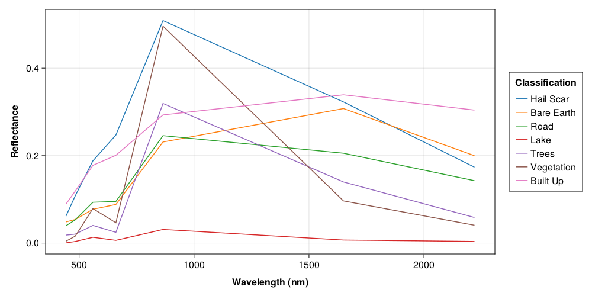

```@meta
CurrentModule = RemoteSensingToolbox
```

# Spectral Analysis

A common application of remotely sensed imagery is land cover classification. One method to accomplish this is to analyze the spectral signatures produced by different types of cover. `RemoteSensingToolbox` provides a number of functions for extracting and visualyzing spectral signatures organized by their associated lan cover.

The first step in our analysis is to load our remotely sensed data and convert the DNs (Digital Numbers) to reflectances. Reflectance is a standardized unit of measurement defined over the interval [0, 1] which denotes the fraction of light that is reflected by the observed surface. A reflectance of 0.0 indicates that no light was reflected whereas a reflectance of 1.0 indicates that 100% of light was reflected.

```julia
using RemoteSensingToolbox, DataFrames, Shapefile, CairoMakie
using Pipe: @pipe

landsat = @pipe Landsat8("data/LC08_L2SP_043024_20200802_20200914_02_T1/") |> dn_to_reflectance(Landsat8, _)
```

Next, we need to load a shapefile which defines some regions containing each type of land cover that we're interested in.

```julia
shp = Shapefile.Table("data/landcover/landcover.shp") |> DataFrame
```

Examining the shapefile gives us some idea of how its contents are structured. As we can see, the regions of interest are stored as `Polygon` objects under the `:geometry` column, while the land cover types are under `:MC_name` and `:C_name`. The `:MC_name` column defines the macroclass, which in our case are built up land, vegetation, bare earth, and water. The `:C_name` column defines the specific class to which some land cover belongs. For example, both "Trees" and "Vegetation" belong to the "Vegetation" macroclass.

```
8×7 DataFrame
 Row │ geometry            fid      MC_ID  MC_name     C_ID   C_name      SCP_UID                   
     │ Polygon             Missing  Int64  String      Int64  String      String                    
─────┼──────────────────────────────────────────────────────────────────────────────────────────────
   1 │ Polygon(38 Points)  missing      1  Built Up        1  Built Up    20230527_122212594060_314
   2 │ Polygon(31 Points)  missing      1  Built Up        2  Road        20230527_122301732906_304
   3 │ Polygon(7 Points)   missing      2  Vegetation      3  Vegetation  20230527_122832068862_302
   4 │ Polygon(57 Points)  missing      2  Vegetation      4  Trees       20230527_123221462871_572
   5 │ Polygon(5 Points)   missing      3  Bare Earth      5  Hail Scar   20230527_123631491671_937
   6 │ Polygon(7 Points)   missing      3  Bare Earth      6  Bare Earth  20230527_123727873290_779
   7 │ Polygon(7 Points)   missing      4  Water           7  Lake        20230527_123931189139_867
   8 │ Polygon(5 Points)   missing      3  Bare Earth      6  Bare Earth  20230527_125120033074_286
```

We can extract the signatures inside each polygon with `extract_signatures`, then compute the average of each land cover class with `summarize_signatures`.

```julia
sigs = extract_signatures(landsat, shp, :C_name) |> summarize_signatures
```

```
7×8 DataFrame
 Row │ label       B1           B2          B3         B4          B5        B6          B7         
     │ String      Float32      Float32     Float32    Float32     Float32   Float32     Float32    
─────┼──────────────────────────────────────────────────────────────────────────────────────────────
   1 │ Hail Scar   0.0617346    0.107954    0.188092   0.247114    0.508847  0.322815    0.173574
   2 │ Bare Earth  0.0483927    0.0539072   0.0773476  0.0883738   0.231219  0.307681    0.199805
   3 │ Road        0.0396956    0.0530674   0.0933762  0.0952315   0.245672  0.205506    0.142639
   4 │ Lake        0.000517442  0.00360272  0.0132789  0.00628491  0.031176  0.00697667  0.00377249
   5 │ Trees       0.0182846    0.0204864   0.0404257  0.0245542   0.319328  0.139772    0.0585171
   6 │ Vegetation  0.00442494   0.015797    0.0789011  0.0464686   0.49601   0.0964562   0.0407997
   7 │ Built Up    0.0892711    0.118764    0.177746   0.200785    0.293111  0.33917     0.304133
```

Finally, we can visualize the signatures as a line graph with `plot_signatures`.

```julia
plot_signatures(Landsat8, sigs)
```


We see that we've plotted the signatures for each land cover type in `shp`. However, we may wish to override the default colors. Fortunately, `plot_signatures` accepts an optional argument allowing us to specify any colors that we wish.

```julia
plot_signatures(Landsat8, sigs; colors=cgrad(:tab10))
```




The `plot_signatures!` method is nearly identical to `plot_signatures`, but it expects a `Makie.Axis` object as its first argument onto which the signatures will be drawn (hence the exclamation). This allows us to create more complicated plots than are supported by `plot_signatures`. We will demonstrate this capability by plotting the same signatures for three different sensors, each of which passed over our study area within a period of four days. For this reason, we can compare the signatures with a single shapefile, as we do not expect the land cover types to change significantly within this span of time.

```julia
# Load Sentinel and DESIS
sentinel = @pipe read_bands(Sentinel2, "data/T11UPT_20200804T183919/R60m/") |> dn_to_reflectance(Sentinel2, _)
desis = @pipe read_bands(DESIS, "data/DESIS-HSI-L2A-DT0884573241_001-20200601T234520-V0210") |> dn_to_reflectance(DESIS, _)
sensors = [landsat, sentinel, desis]

# Create Figure
fig = Figure(resolution=(1000, 800))

# Create Axes
ax1 = Axis(fig[1,1], title="Landsat 8", xticksvisible=false, xticklabelsvisible=false)
ax2 = Axis(fig[2,1], title="Sentinel 2", ylabel="Reflectance", ylabelfont=:bold, xticksvisible=false, xticklabelsvisible=false)
ax3 = Axis(fig[3,1], title="DESIS", xlabel="Wavelength (nm)", xlabelfont=:bold)
axs = [ax1, ax2, ax3]

# Plot Signatures
colors = cgrad([:saddlebrown, :orange, :navy, :green], 4, categorical=true)
for (bandset, sensor, ax) in zip((Landsat8, Sentinel2, DESIS), sensors, axs)
   @pipe extract_signatures(sensor, shp, :MC_name) |> summarize_signatures |> plot_signatures!(ax, bandset, _; colors=colors)
   xlims!(ax, 400, 1000)
end

# Add Legend
Legend(fig[1:3,2], first(axs), "Classification")
```

