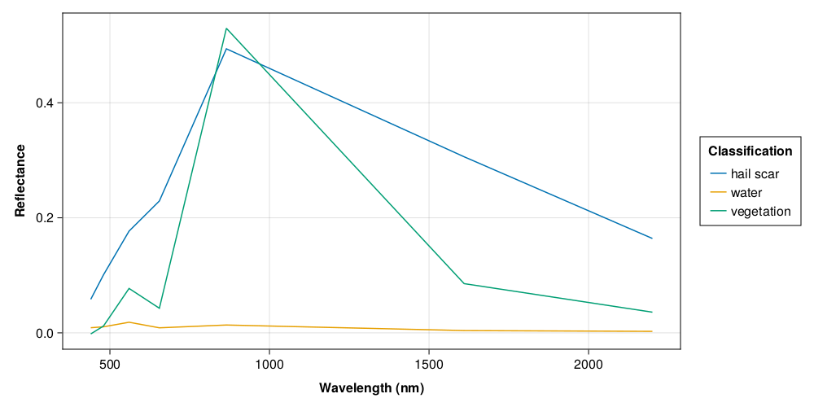

```@meta
CurrentModule = RSToolbox
```

# Spectral Analysis Example

A common application of remotely sensed imagery is land cover classification. One method to accomplish this is to analyze the spectral signatures produced by different types of cover. `RSToolbox` provides a number of functions for extracting and visualyzing spectral signatures organized by their associated lan cover.

The first step in our analysis is to load our remotely sensed data and convert the DNs (Digital Numbers) to reflectances. Reflectance is a standardized unit of measurement defined over the interval [0, 1] which denotes the fraction of light that is reflected by the observed surface. A reflectance of 0.0 indicates that no light was reflected whereas a reflectance of 1.0 indicates that 100% of light was reflected.

```julia
using RSToolbox, DataFrames, Shapefile

landsat = Landsat8("data/LC08_L2SP_043024_20200802_20200914_02_T1/") |> dn_to_reflectance
```

Next, we need to load a shapefile which defines regions of interest containing each type of land cover within our study area.

```julia
shp = Shapefile.Table("data/landcover/landcover.shp") |> DataFrame
```

Examining the shapefile gives us some idea of how its contents are structured.

```
3×3 DataFrame
 Row │ geometry           id     cover      
     │ Polygon            Int64  String     
─────┼──────────────────────────────────────
   1 │ Polygon(5 Points)      1  hail scar
   2 │ Polygon(6 Points)      2  water
   3 │ Polygon(5 Points)      3  vegetation
```

As we can see, the regions of interest are stored as `Polygon` objects under the `:geometry` column, while the land cover type is under `:cover`.

We can call `plot_signatures` to extract and visualize the signatures of each type of cover specified in `shp`. This method expects the `RasterStack` or `AbstractSensor` from which we want to extract the signatures, a shapefile denoting the regions of interest, the column in the shapefile recording the land cover type, and a destination to which the plot will be saved.

```julia
plot_signatures(landsat, shp, :cover, "landsat_sigs.png")
```

